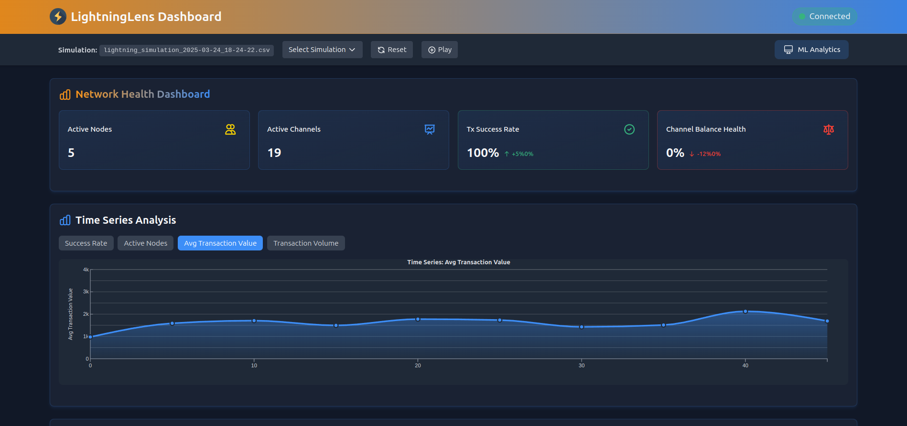
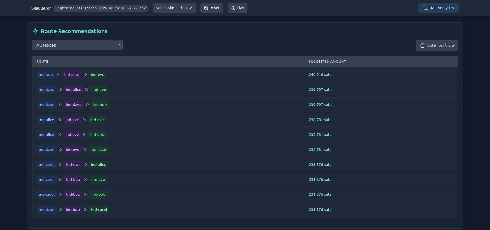
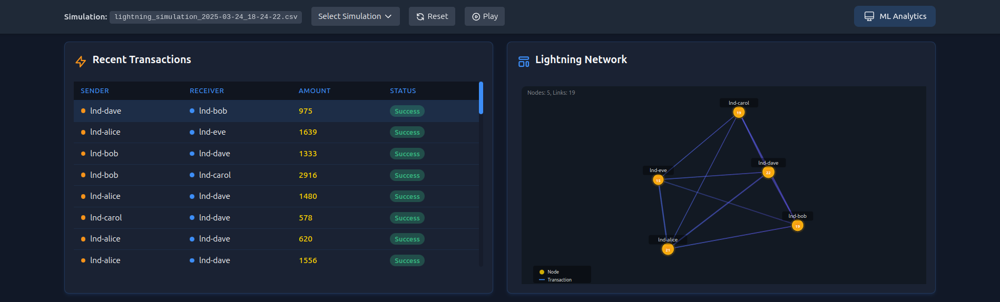

# Under Construction

# ⚡ LightningLens Platform ⚡


A research project for optimizing Lightning Network liquidity through machine learning analysis.

## Overview

Lightning Lens Platform combines two components:

- **Lightning Network Simulation**: A Docker-based testnet simulation environment
- **Lightning Lens AI Analysis**: Machine learning tools for channel optimization

The platform automatically collects transaction data, analyzes network patterns, and provides intelligent rebalancing suggestions to optimize liquidity distribution across channels.

## LightningLens Dashboard

This project provides real-time monitoring, route optimization, and network visualization to help node operators make data-driven decisions.

### Dashboard Screenshots

#### Network Health Overview


_The main dashboard provides key network health metrics including active nodes, channels, transaction success rate, and time series analysis of transaction values. Real-time monitoring allows operators to quickly identify network performance trends._

#### Route Recommendations


_Machine learning route recommendations suggest optimal payment paths between nodes with calculated amounts. This helps node operators maximize transaction success rates while minimizing fees, improving overall network efficiency._

#### Network Visualization & Transaction Flow


_Interactive network topology visualization shows node relationships and transaction flows. The transaction flow analysis highlights the most active payment channels, providing insights into network utilization patterns._

## System Architecture

```
┌───────────────────────────────────────┐      ┌─────────────────────────────────────┐
│      Lightning Network Simulation      │      │          LightningLens            │
├───────────────────────────────────────┤      ├─────────────────────────────────────┤
│  ┌─────────────┐    ┌─────────────┐   │      │  ┌─────────────┐    ┌─────────────┐ │
│  │  Lightning  │    │  WebSocket  │   │      │  │  WebSocket  │    │    Model    │ │
│  │    Nodes    │◄──►│   Server    │◄──┼──────┼─►│   Client    │◄──►│  Processor  │ │
│  └─────────────┘    └─────────────┘   │      │  └─────────────┘    └─────────────┘ │
│        ▲                  ▲           │      │                           │         │
│        │                  │           │      │                           │         │
│        ▼                  │           │      │                           ▼         │
│  ┌─────────────┐    ┌─────────────┐   │      │  ┌─────────────┐    ┌─────────────┐ │
│  │ Transaction │    │ Rebalancing │◄──┼──────┼──┤ Suggestions │◄───┤   Online    │ │
│  │  Generator  │───►│   Engine    │   │      │  │  Generator  │    │   Learner   │ │
│  └─────────────┘    └─────────────┘   │      │  └─────────────┘    └─────────────┘ │
│        │                              │      │                           ▲         │
│        ▼                              │      │                           │         │
│  ┌─────────────┐    ┌─────────────┐   │      │                           │         │
│  │   Channel   │───►│   Feature   │───┼──────┼─►                         │         │
│  │    State    │    │   Adapter   │   │      │                           │         │
│  └─────────────┘    └─────────────┘   │      │                           │         │
└───────────────────────────────────────┘      └───────────────────────────┼─────────┘
                                                                  ┌─────────┴────────┐
                                                                  │  Trained Model   │
                                                                  │    & Scaler      │
                                                                  └──────────────────┘
                                                                           │
                                                                           ▼
                                                                  ┌──────────────────┐
                                                                  │     React UI     │
                                                                  │    Dashboard     │
                                                                  └──────────────────┘
```

## Installation

### Quick Setup (Recommended)

Use the provided setup script to automatically create environments and install dependencies:

```bash
# Make the script executable
chmod +x setup_environments.sh

# Run the setup script
./setup_environments.sh
```

### Manual Installation

If you prefer to set up manually:

1. Install the requirements:

```bash
pip install -r requirements.txt
```

2. Set up the PYTHONPATH:

```bash
export PYTHONPATH=$PYTHONPATH:/path/to/LIGHTNING-LENS:/path/to/LIGHTNING-LENS/Lightning-Lens/lightning_lens
```

### Docker Requirements

The Lightning Network simulation requires Docker and Docker Compose:

```bash
# Install Docker (Ubuntu example)
sudo apt-get update
sudo apt-get install docker.io docker-compose

# Verify installation
docker --version
docker-compose --version
```

# //////////////////////////////////////////////////////////////////////////////

# //////////////////////////////////////////////////////////////////////////////

# //////////////////////////////////////////////////////////////////////////////

# //////////////////////////////////////////////////////////////////////////////

# //////////////////////////////////////////////////////////////////////////////

# //////////////////////////////////////////////////////////////////////////////

## Workflow

To run the complete system with Lightning Lens:

# Running the Visualization

```bash
# To set up Lightning Network nodes
./setup-nodes.sh
# To start the simulation
start_simulation.sh
# To start the dashboard
./start-dashboard.sh
```

# Starting Processes of the Machine Learning Data Pipeline (Training model and data flow)

```bash
./start.sh
```

---

---

---

1.

# Pruning old containers and restarts everything from scratch

# Takes approx. 5 min

./setup-nodes-continue.sh

2.  ./start.sh

npm run

3.

# THIS

./start-simple-dashboard.sh

## ./start_simulation.sh

---

## ./start-dashboard.sh

# Start data processing pipeline

./process_data.sh

# What this does:

# Convert the raw JSON data to CSV

# Transform the transaction data

# Generate features from the transformed data

# Train the initial model

# Report the path to your newly trained model

#Frontend display
./setup_dependencies.sh

./start_proxy.sh

npm start

```

## Todo

- Introduce more nodes into the lightning simulation
- Create more randomness
- Introduce more strategies and fail-scenariosfor the ML to improve upon

## Services and Ports

The Lightning Lens platform consists of several interconnected services:

| Service              | Port | Description                                |
| -------------------- | ---- | ------------------------------------------ |
| WebSocket Server     | 8768 | Sends data from the simulation             |
| HTTP Server          | 8000 | Main API server for the backend            |
| Enhanced HTTP Server | 5000 | Advanced API server for learning dashboard |
| Adapter Proxy        | 8001 | Transforms data between systems            |
| WebSocket Client     | 8766 | Receives data from the simulation          |
| Suggestions Service  | 8767 | Provides rebalancing suggestions           |
| CORS Proxy           | 3003 | Handles CORS and API routing               |
| Frontend             | 3000 | React dashboard UI                         |

## License

This project is licensed under the MIT License.
```
