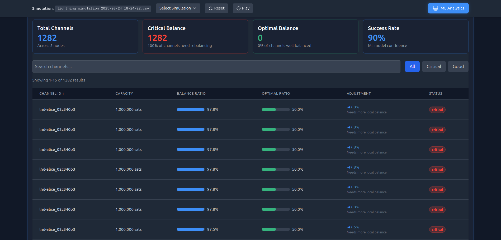
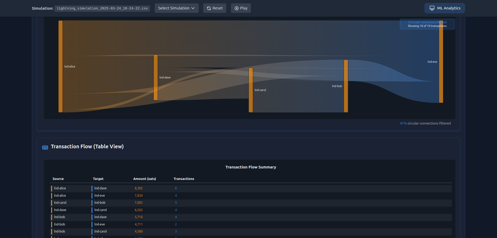

# Under Construction

# ⚡ LightningLens Platform ⚡


A research project for optimizing Lightning Network liquidity through machine learning analysis.

## Overview

Lightning Lens Platform combines two components:

- **Lightning Network Simulation**: A Docker-based testnet simulation environment
- **Lightning Lens AI Analysis**: Machine learning tools for channel optimization

The platform automatically collects transaction data, analyzes network patterns, and provides intelligent rebalancing suggestions to optimize liquidity distribution across channels.

## LightningLens Dashboard

This project provides real-time monitoring, route optimization, and network visualization to help node operators make data-driven decisions.

### Dashboard Screenshots

#### Network Health Overview


_The dashboard showcases key network metrics providing an at-a-glance view of active nodes, channels, transaction volume, and success rates._

#### Channel Balance Analysis


_The channel balance visualization displays the distribution of funds across Lightning Network channels, helping operators identify imbalances that could affect payment routing. The intuitive color coding highlights channels that require attention for optimal performance._

#### Network Topology Visualization


_The interactive network graph visualizes node connections and channel relationships with real-time animations of transaction flows. Node clustering and edge filtering capabilities allow operators to focus on specific network segments for detailed analysis._

#### ML Analytics Dashboard


_The machine learning analytics section provides predictive insights into channel performance with advanced metrics on optimal balancing ratios. The AI-powered recommendations help operators make data-driven decisions to maximize routing efficiency and transaction success rates._

#### Transaction Flow Analysis


_The Sankey diagram visualizes payment flows through the network, highlighting key routing paths and bottlenecks. The accompanying transaction table provides detailed information about each payment, enabling operators to trace and analyze specific network events._

## System Architecture

```
┌───────────────────────────────────────┐      ┌─────────────────────────────────────┐
│      Lightning Network Simulation      │      │          LightningLens            │
├───────────────────────────────────────┤      ├─────────────────────────────────────┤
│  ┌─────────────┐    ┌─────────────┐   │      │  ┌─────────────┐    ┌─────────────┐ │
│  │  Lightning  │    │  WebSocket  │   │      │  │  WebSocket  │    │    Model    │ │
│  │    Nodes    │◄──►│   Server    │◄──┼──────┼─►│   Client    │◄──►│  Processor  │ │
│  └─────────────┘    └─────────────┘   │      │  └─────────────┘    └─────────────┘ │
│        ▲                  ▲           │      │                           │         │
│        │                  │           │      │                           │         │
│        ▼                  │           │      │                           ▼         │
│  ┌─────────────┐    ┌─────────────┐   │      │  ┌─────────────┐    ┌─────────────┐ │
│  │ Transaction │    │ Rebalancing │◄──┼──────┼──┤ Suggestions │◄───┤   Online    │ │
│  │  Generator  │───►│   Engine    │   │      │  │  Generator  │    │   Learner   │ │
│  └─────────────┘    └─────────────┘   │      │  └─────────────┘    └─────────────┘ │
│        │                              │      │                           ▲         │
│        ▼                              │      │                           │         │
│  ┌─────────────┐    ┌─────────────┐   │      │                           │         │
│  │   Channel   │───►│   Feature   │───┼──────┼─►                         │         │
│  │    State    │    │   Adapter   │   │      │                           │         │
│  └─────────────┘    └─────────────┘   │      │                           │         │
└───────────────────────────────────────┘      └───────────────────────────┼─────────┘
                                                                  ┌─────────┴────────┐
                                                                  │  Trained Model   │
                                                                  │    & Scaler      │
                                                                  └──────────────────┘
                                                                           │
                                                                           ▼
                                                                  ┌──────────────────┐
                                                                  │     React UI     │
                                                                  │    Dashboard     │
                                                                  └──────────────────┘
```

## Installation

### Quick Setup (Recommended)

Use the provided setup script to automatically create environments and install dependencies:

```bash
# Make the script executable
chmod +x setup_environments.sh

# Run the setup script
./setup_environments.sh
```

### Manual Installation

If you prefer to set up manually:

1. Install the requirements:

```bash
pip install -r requirements.txt
```

### Docker Requirements

The Lightning Network simulation requires Docker and Docker Compose:

```bash
# Install Docker (Ubuntu example)
sudo apt-get update
sudo apt-get install docker.io docker-compose

# Verify installation
docker --version
docker-compose --version
```

## Workflow

To run the complete system with Lightning Lens:

# Running the Visualization

```bash
# To set up Lightning Network nodes
./setup-nodes.sh
# To start the simulation
start_simulation.sh
# To start the dashboard
./start-dashboard.sh
```

# Starting Processes of the Machine Learning Data Pipeline (Training model and data flow)

```bash
./start.sh
```

# Start data processing pipeline

./process_data.sh

## What this does:

- Convert the raw JSON data to CSV
- Transform the transaction data
- Generate features from the transformed data
- Train the initial model

## Services and Ports

The Lightning Lens platform consists of several interconnected services:

| Service              | Port | Description                                |
| -------------------- | ---- | ------------------------------------------ |
| WebSocket Server     | 8768 | Sends data from the simulation             |
| HTTP Server          | 8000 | Main API server for the backend            |
| Enhanced HTTP Server | 5000 | Advanced API server for learning dashboard |
| Adapter Proxy        | 8001 | Transforms data between systems            |
| WebSocket Client     | 8766 | Receives data from the simulation          |
| Suggestions Service  | 8767 | Provides rebalancing suggestions           |
| CORS Proxy           | 3003 | Handles CORS                               |

## License

This project is licensed under the MIT License.

```

```
